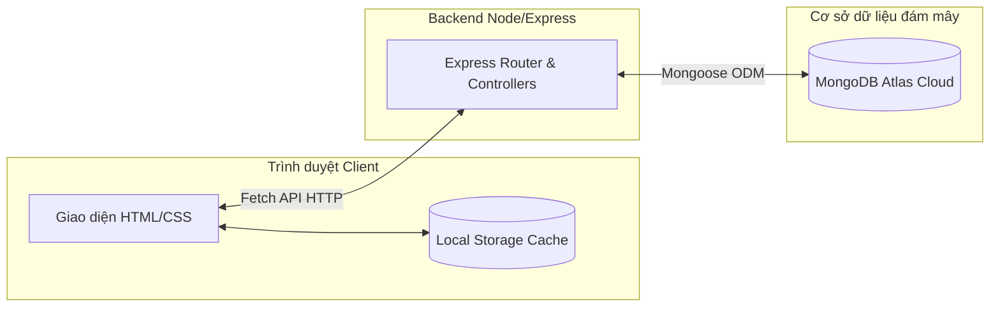

## 1. TỔNG QUAN KIẾN TRÚC LƯU TRỮ 3 TẦNG (3-TIER STORAGE)

Hệ thống được thiết kế theo mô hình **Client - Server - Database** linh hoạt kết hợp với cơ chế đồng bộ hóa dữ liệu lai:



- **Tầng 1: Trình duyệt Client (Giao diện & LocalStorage Cache):**
  Lưu trữ tạm thời trạng thái người dùng đăng nhập hiện tại và bản sao dữ liệu của hệ thống để hiển thị nhanh chóng, giảm tải lượng request mạng và hỗ trợ chạy offline khi mất kết nối mạng.
- **Tầng 2: Backend API Server (Node.js & Express):**
  Lớp trung gian thực hiện tiếp nhận yêu cầu từ client, xử lý logic nghiệp vụ đào tạo, xác thực người dùng, và bảo vệ cơ sở dữ liệu.
- **Tầng 3: Cloud Database (MongoDB Atlas):**
  Cơ sở dữ liệu quan trọng nhất lưu trữ vĩnh viễn toàn bộ các bản ghi của hệ thống như tài khoản, thông báo, bài tập, lớp học và điểm số.

---

## 2. DANH SÁCH CHI TIẾT CÁC API ENDPOINT (BACKEND ROUTERS)

Hệ thống sử dụng các API RESTful để đồng bộ và thao tác dữ liệu. Chi tiết các route được viết trong [server.js](file:///c:/Users/quyet/Desktop/BTL%20%20JS/backend/server.js):

| Phương thức | Đường dẫn API | Mục tiêu tác động | Mô tả chức năng |
| :--- | :--- | :--- | :--- |
| **POST** | `/api/auth/dang-ky` | Bảng `users` | Đăng ký tài khoản mới cho sinh viên hoặc giảng viên. |
| **POST** | `/api/auth/dang-nhap` | Bảng `users` | Xác thực đăng nhập tài khoản người dùng. |
| **GET** | `/api/nguoi-dung` | Bảng `users` | Lấy danh sách tài khoản trong hệ thống. |
| **PUT** | `/api/nguoi-dung/:id` | Bảng `users` | Cập nhật hồ sơ cá nhân và danh sách thông báo đã đọc. |
| **DELETE** | `/api/nguoi-dung/:id` | Bảng `users` | Xóa tài khoản người dùng khỏi hệ thống (Quyền Admin). |
| **GET** | `/api/thong-bao` | Bảng `notifications` | Lấy danh sách toàn bộ thông báo hệ thống. |
| **POST** | `/api/thong-bao` | Bảng `notifications` | Tạo thông báo mới (Admin hoặc Giảng viên giao bài). |
| **PUT** | `/api/thong-bao/:id` | Bảng `notifications` | Sửa tiêu đề, nội dung hoặc tệp đính kèm thông báo. |
| **DELETE** | `/api/thong-bao/:id` | Bảng `notifications` | Xóa thông báo khỏi cơ sở dữ liệu. |
| **GET** | `/api/tai-lieu` | Bảng `materials` | Lấy toàn bộ tài liệu giảng dạy và đề bài tập. |
| **GET** | `/api/tai-lieu/:id` | Bảng `materials` | Lấy chi tiết nội dung tệp đính kèm của tài liệu theo ID. |
| **POST** | `/api/tai-lieu` | Bảng `materials` | Tải lên tài liệu/bài tập mới (chứa file dạng base64). |
| **PUT** | `/api/tai-lieu/:id` | Bảng `materials` | Chỉnh sửa tên tệp hoặc đường dẫn tài liệu. |
| **DELETE** | `/api/tai-lieu/:id` | Bảng `materials` | Xóa tài liệu khỏi hệ thống. |
| **GET** | `/api/nop-bai` | Bảng `submissions` | Lấy danh sách toàn bộ các bài làm của sinh viên. |
| **GET** | `/api/nop-bai/:id` | Bảng `submissions` | Lấy thông tin bài làm cụ thể theo ID bài nộp. |
| **POST** | `/api/nop-bai` | Bảng `submissions` | Sinh viên nộp bài làm trực tuyến (chứa link/file). |
| **GET** | `/api/lop-hoc` | Bảng `classes` | Lấy danh sách lớp học trực tuyến. |
| **POST** | `/api/lop-hoc` | Bảng `classes` | Tạo lớp học phần mới (Admin quản trị). |
| **PUT** | `/api/lop-hoc/:id` | Bảng `classes` | Cập nhật thông tin điểm danh, điểm số của sinh viên. |
| **DELETE** | `/api/lop-hoc/:id` | Bảng `classes` | Xóa lớp học phần khỏi hệ thống. |

---

## 3. THIẾT KẾ PHÂN TÁCH LƯU TRỮ DỮ LIỆU

### A. Dữ liệu lưu tại LocalStorage (Client Browser)
Mã nguồn frontend sử dụng LocalStorage để đệm dữ liệu nhằm tối đa hóa tốc độ phản hồi:
- `currentUser`: Lưu trữ đối tượng người dùng hiện tại đang đăng nhập (bao gồm ID, Họ tên, Vai trò, danh sách ID thông báo đã đọc `readNotifs`).
- `Users`: Mảng lưu trữ danh sách tài khoản người dùng phục vụ tra cứu.
- `Classes`: Mảng lưu trữ thông tin các lớp học phần gồm danh sách buổi học, trạng thái chuyên cần và bảng điểm của sinh viên.
- `Notifications`: Mảng chứa thông báo nội bộ.
- `Materials`: Bản sao danh sách tiêu đề tài liệu.
- `Submissions`: Bản sao danh sách bài nộp của học sinh.

### B. Dữ liệu lưu tại MongoDB Atlas (Cloud Database)
Cơ sở dữ liệu tập trung lưu trữ toàn bộ các bảng ghi nhị phân dài hạn:
- **Bảng `users` (Users Collection):** Lưu thông tin tài khoản đăng nhập (mã ID, email, mật khẩu băm, họ tên, vai trò `sinh-vien`/`giang-vien`/`admin`).
- **Bảng `classes` (Classes Collection):** Lưu chi tiết các lớp học phần, lịch học tuần, danh sách sinh viên ghi danh, trạng thái điểm danh và điểm số.
- **Bảng `notifications` (Notifications Collection):** Lưu toàn bộ các dòng thông báo kèm thời gian đăng và liên kết ID bài tập.
- **Bảng `materials` (Materials Collection):** Lưu trữ tài liệu. Đặc biệt trường `link` chứa chuỗi dữ liệu Base64 đầy đủ của các tệp tin đính kèm (PDF, Word, Ảnh) để tải trực tuyến.
- **Bảng `submissions` (Submissions Collection):** Lưu bài làm nộp trực tuyến của sinh viên (liên kết học viên, lớp học phần, file đính kèm dạng Base64 và liên kết bài nộp).

---

## 4. GIẢI THÍCH CHI TIẾT MÃ NGUỒN CỐT LÕI

### A. Viết API Endpoint và Lưu Cơ sở dữ liệu MongoDB (Backend - Express & Mongoose)
Đoạn mã sau nằm trong `server.js` xử lý yêu cầu sinh viên nộp bài tập và lưu trữ vào MongoDB:

```javascript
// POST API: Nhận bài nộp trực tuyến của sinh viên từ client
app.post('/api/nop-bai', async (req, res) => {
    try {
        // Khởi tạo đối tượng tài liệu mới từ Schema đã được khai báo
        const assignment = new NopBaiModel({
            id: req.body.id,                 // ID bài nộp (ví dụ sinh ra từ Date.now())
            materialId: req.body.materialId, // ID của bài tập được giao
            studentId: req.body.studentId,   // ID mã sinh viên nộp bài
            studentName: req.body.studentName,// Họ tên sinh viên nộp bài
            classId: req.body.classId,       // Lớp học phần
            submitTime: req.body.submitTime, // Thời điểm nộp bài
            link: req.body.link || '',       // Link URL (nếu nộp link)
            fileName: req.body.fileName || ''// Tên file (nếu nộp file từ máy)
        });
        
        // Gọi phương thức lưu trữ trực tiếp của Mongoose để đẩy dữ liệu lên MongoDB Atlas
        const saved = await assignment.save();
        
        // Trả về kết quả JSON trạng thái 201 cho client
        res.status(201).json(saved);
    } catch (err) {
        // Xử lý lỗi nếu kết nối MongoDB bị gián đoạn
        res.status(400).json({ message: err.message });
    }
});
```

* **Giải thích chi tiết:**
  - `new NopBaiModel(...)`: Khởi tạo một Document mới dựa trên Mongoose Model `NopBai`. Mongoose tự động kiểm duyệt kiểu dữ liệu của các trường xem có khớp với Schema thiết lập hay không.
  - `await assignment.save()`: Đây là câu lệnh bất đồng bộ (`async/await`) gửi dữ liệu qua giao thức TCP đến máy chủ đám mây MongoDB Atlas. Hàm sẽ dừng thực thi tạm thời và chỉ chạy tiếp khi MongoDB phản hồi đã ghi nhận dữ liệu thành công.

---

### B. Gọi API từ Frontend bằng Fetch API (Client-side)
Đoạn mã xử lý đồng bộ hóa tự động từ máy khách lên server nằm trong `app.js`:

```javascript
// Hàm đồng bộ dữ liệu tự động giữa máy khách (LocalStorage) và MongoDB Server
async function dongBoDuLieuTuDong() {
    try {
        // Thực hiện cuộc gọi GET API bất đồng bộ đến server backend để lấy danh sách thông báo mới nhất
        const res = await fetch(`${API_BASE}/api/thong-bao`);
        if (res.ok) {
            // Chuyển đổi dữ liệu thô nhận được sang định dạng mảng JSON
            const serverNotifs = await res.json();
            // Cập nhật lại kho dữ liệu đệm LocalStorage
            localStorage.setItem('Notifications', JSON.stringify(serverNotifs));
        }
    } catch (error) {
        console.warn("Mất kết nối mạng. Ứng dụng tự động chạy ở chế độ offline.", error);
    }
}
```

* **Giải thích chi tiết:**
  - `fetch(`${API_BASE}/api/thong-bao`)`: Trình duyệt gửi một HTTP Request dạng GET đến server Node.js. Biến `API_BASE` tự động nhận giá trị qua origin giúp tránh lỗi xung đột cổng.
  - `await res.json()`: Giải mã luồng dữ liệu phản hồi (Response Stream) từ server và chuyển sang mảng đối tượng JavaScript gốc.
  - `localStorage.setItem(...)`: Ghi đè mảng thông báo vừa lấy được vào LocalStorage dưới dạng chuỗi văn bản JSON để phục vụ hiển thị offline.

---

### C. Đọc/Ghi dữ liệu LocalStorage kèm theo cơ chế bắt lỗi bộ nhớ
Đoạn mã hai hàm đa dụng của hệ thống nằm trong `app.js`:

```javascript
// Hàm đọc dữ liệu an toàn từ LocalStorage
function layCSDL(key) {
    try {
        const data = localStorage.getItem(key);
        // Nếu không có dữ liệu, trả về mảng rỗng làm mặc định để tránh lỗi crash chương trình
        return data ? JSON.parse(data) : [];
    } catch (e) {
        console.error("Lỗi đọc dữ liệu LocalStorage khóa: " + key, e);
        return [];
    }
}

// Hàm ghi dữ liệu an toàn vào LocalStorage, xử lý lỗi đầy bộ nhớ (QuotaExceededError)
function ghiCSDL(key, duLieu) {
    try {
        // Chuyển đối tượng/mảng sang dạng chuỗi JSON và lưu vào bộ nhớ trình duyệt
        localStorage.setItem(key, JSON.stringify(duLieu));
    } catch (e) {
        // Kiểm tra mã lỗi xem có phải do bộ nhớ LocalStorage bị đầy (giới hạn 5MB)
        if (e.name === 'QuotaExceededError' || e.code === 22) {
            console.warn("Cảnh báo: Bộ nhớ LocalStorage đã đầy! Đang tự động dọn dẹp các tệp đính kèm cũ...");
            // Thực hiện dọn dẹp các file đính kèm lớn trong Materials để nhường chỗ cho dữ liệu mới
            let taiLieu = layCSDL('Materials');
            taiLieu.forEach(m => {
                if (m.link && m.link.startsWith('data:')) {
                    m.link = ""; // Xóa dữ liệu Base64 của tệp đính kèm cũ để giải phóng dung lượng
                }
            });
            localStorage.setItem('Materials', JSON.stringify(taiLieu));
            // Thử lưu lại dữ liệu mong muốn sau khi đã giải phóng bộ nhớ
            localStorage.setItem(key, JSON.stringify(duLieu));
        } else {
            console.error("Lỗi ghi dữ liệu LocalStorage:", e);
        }
    }
}
```

* **Giải thích chi tiết:**
  - `localStorage.getItem` / `setItem`: Hàm tương tác trực tiếp với bộ lưu trữ ổ cứng của trình duyệt. Dữ liệu bắt buộc phải là dạng chuỗi (`string`), nên ta dùng `JSON.stringify` để nén mảng/đối tượng và `JSON.parse` để giải nén lại.
  - `QuotaExceededError`: Trình duyệt chỉ cấp tối đa 5MB cho mỗi tên miền. Nếu ứng dụng chứa quá nhiều tệp đính kèm base64 dung lượng lớn, khối `catch` sẽ kích hoạt tự động cắt giảm dữ liệu tệp đính kèm cũ để bảo vệ ứng dụng khỏi bị đơ/tắt đột ngột.

---

## 5. HƯỚNG DẪN CHI TIẾT MỞ LOCAL STORAGE XEM CÁC DỮ LIỆU ĐANG LƯU TRỮ

Để xem chi tiết dữ liệu lưu trữ tạm thời bên trong trình duyệt (Chrome hoặc Microsoft Edge), bạn thực hiện theo các bước sau:

1. **Bước 1:** Mở trang ứng dụng (Ví dụ: `http://localhost:5000` hoặc mở file HTML).
2. **Bước 2:** Nhấn phím **F12** trên bàn phím (hoặc click chuột phải vào vùng trống bất kỳ trên trang web và chọn **Kiểm tra - Inspect**).
3. **Bước 3:** Trên thanh công cụ trên cùng của cửa sổ công cụ lập trình hiện ra, chọn tab **Application** (Nếu không thấy, nhấn vào ký hiệu mũi tên kép `>>` để hiện menu ẩn).
4. **Bước 4:** Ở thanh menu danh mục bên trái, tìm mục **Storage** -> nhấn mở rộng mục **Local Storage**.
5. **Bước 5:** Nhấn chọn vào dòng URL trang web hiện tại của bạn (Ví dụ: `http://localhost:5000`).
6. **Bước 6:** Bạn sẽ nhìn thấy bảng dữ liệu gồm hai cột: **Key** (Khóa) và **Value** (Giá trị tương ứng). Bạn có thể bấm vào từng Khóa (như `currentUser`, `Classes`, `Notifications`) để xem nội dung chi tiết bên dưới.

---

## 6. CÁC HÀM TÌM KIẾM VÀ TRUY VẤN DỮ LIỆU CỐT LÕI (SEARCH & FILTER FUNCTIONS)

Hệ thống kết hợp các phương thức tìm kiếm cơ sở dữ liệu trên Backend (thông qua Mongoose ODM) và lọc/tìm kiếm danh mục trên Frontend (thông qua các hàm mảng JavaScript). Dưới đây là chi tiết mã nguồn và ý nghĩa từng dòng:

### A. Tìm kiếm tài khoản khi đăng nhập trên Backend (Mongoose findOne & select)
Đoạn mã sau nằm trong API đăng nhập tại [server.js](file:///c:/Users/quyet/Desktop/BTL%20%20JS/backend/server.js):

```javascript
// Tìm tài khoản khớp với Email hoặc Mã số ID và khớp với Vai trò, đồng thời gọi thêm trường mật khẩu đã bị ẩn (select: false)
const nguoiDung = await NguoiDungModel.findOne({
    $or: [{ email: input.toLowerCase() }, { id: input }], // So khớp tài khoản đầu vào là email hoặc mã ID
    role // Khớp cả vai trò
}).select('+password'); // Buộc Mongoose phải nạp thêm trường password (vốn đã bị ẩn bởi select: false trong Schema)
```

* **Giải thích chi tiết từng dòng:**
  - `NguoiDungModel.findOne({ ... })`: Hàm tìm kiếm bất đồng bộ của Mongoose để truy vấn ra **duy nhất một bản ghi (document)** thỏa mãn điều kiện chỉ định từ bảng `users`.
  - `$or: [{ email: input.toLowerCase() }, { id: input }]`: Sử dụng toán tử điều kiện logic `$or` của MongoDB để chấp nhận đăng nhập bằng một trong hai thông tin: email (đã được chuyển thành chữ thường bằng `.toLowerCase()`) hoặc mã số định danh ID gốc.
  - `role`: Trường so khớp bổ sung, đảm bảo tài khoản tìm thấy phải thuộc đúng vai trò được chọn tại giao diện đăng nhập (admin, giang-vien, sinh-vien).
  - `.select('+password')`: Trường mật khẩu `password` trong Mongoose Schema đã được thiết lập `select: false` để tự động loại trừ khỏi kết quả tìm kiếm thông thường. Hàm `.select('+password')` yêu cầu server nạp thêm trường này để phục vụ so sánh băm mật khẩu Bcrypt.

### B. Hàm lọc thông báo hiển thị cho sinh viên ở Frontend (Array filter)
Đoạn mã lọc danh sách thông báo theo lớp học phần nằm trong file [sinhvien.js](file:///c:/Users/quyet/Desktop/BTL%20%20JS/frontend/js/sinhvien.js) và [app.js](file:///c:/Users/quyet/Desktop/BTL%20%20JS/frontend/js/app.js):

```javascript
// Tiến hành lọc thông báo dựa trên lớp học và loại thông báo chung
let tbLoc = thongBao.filter(n => {
    // Trường hợp sinh viên chọn lọc "Tất cả thông báo" (mặc định)
    if (giaTriLoc === 'all') {
        // Chỉ hiển thị thông báo chung toàn trường hoặc thông báo gửi riêng tới lớp học của sinh viên đó
        return n.target === 'tat-ca-sinh-vien' || dsMaLopCuaToi.includes(n.target);
    } else {
        // Nếu chọn một lớp cụ thể, chỉ lấy thông báo gửi riêng cho mã lớp học đó
        return n.target === giaTriLoc;
    }
});
```

* **Giải thích chi tiết từng dòng:**
  - `thongBao.filter(n => { ... })`: Phương thức `.filter()` tạo một mảng con mới từ mảng `thongBao`. Một thông báo `n` được giữ lại nếu hàm callback trả về giá trị `true`.
  - `if (giaTriLoc === 'all')`: Kiểm tra xem người dùng đang chọn lọc tất cả thông báo hay lọc cụ thể theo lớp.
  - `return n.target === 'tat-ca-sinh-vien' || dsMaLopCuaToi.includes(n.target)`: Lọc ra các thông báo nhắm mục tiêu là `tat-ca-sinh-vien` hoặc các thông báo có đích đến nằm trong danh sách mã lớp học phần sinh viên đang theo học (`dsMaLopCuaToi`).
  - `return n.target === giaTriLoc`: Khi lọc một lớp duy nhất, điều kiện này lọc ra chính xác các thông báo có trường `target` trùng khớp với mã lớp đang được chọn trong dropdown.

### C. Hàm tìm kiếm chi tiết một lớp học ở Frontend (Array find)
Đoạn mã tìm kiếm thông tin chi tiết của một lớp học từ danh sách cache để hiển thị popup nằm tại [sinhvien.js](file:///c:/Users/quyet/Desktop/BTL%20%20JS/frontend/js/sinhvien.js):

```javascript
// Tìm kiếm lớp học tương ứng theo mã ID lớp
let lop = lopHocs.find(c => c.id === idLop); 
```

* **Giải thích chi tiết từng dòng:**
  - `lopHocs.find(...)`: Phương thức `.find()` của JavaScript duyệt qua mảng `lopHocs` và trả về **phần tử đầu tiên** thỏa mãn biểu thức logic kiểm tra.
  - `c => c.id === idLop`: So sánh mã định danh lớp học `c.id` với `idLop` được chọn trên giao diện. Nếu khớp, đối tượng lớp học đó sẽ được gán cho biến `lop`, nếu không có kết quả nào khớp sẽ trả về `undefined`.

---

## 7. CƠ CHẾ BẢO MẬT MÃ HÓA MẬT KHẨU (PASSWORD SECURITY & HASHING)

Hệ thống tuân thủ các quy tắc bảo mật thông tin tiêu chuẩn để đảm bảo an toàn tuyệt đối cho tài khoản người dùng:

### A. Tại sao KHÔNG lưu mật khẩu (kể cả mật khẩu đã băm) ở LocalStorage?
* **Rủi ro rò rỉ (XSS Vulnerability):** LocalStorage của trình duyệt rất dễ bị đọc bởi các mã độc JavaScript (nếu trang web có lỗ hổng XSS). Nếu ta lưu mật khẩu ở LocalStorage, kẻ tấn công có thể lấy trộm chuỗi mã hóa này và thực hiện các cuộc tấn công chiếm quyền kiểm soát.
* **Nguyên lý thiết kế:** Trình duyệt Client sau khi đăng nhập thành công chỉ cần lưu thông tin cá nhân cơ bản để hiển thị lên màn hình (`id`, `name`, `role`, `email`). **Trường mật khẩu hoàn toàn bị xóa bỏ (delete userObj.password)** khỏi bộ nhớ LocalStorage ngay khi nhận phản hồi từ Server để loại trừ mọi khả năng rò rỉ thông tin cá mật.

### B. Cơ chế băm mật khẩu bằng BcryptJS lưu trên MongoDB Atlas (Backend)
Để bảo vệ mật khẩu của người dùng không bị đọc trộm kể cả khi cơ sở dữ liệu bị lộ, hệ thống thực hiện băm mật khẩu một chiều bằng thuật toán mã hóa BcryptJS tại Backend Server trước khi lưu trữ vào MongoDB Atlas.

#### 1. Mã nguồn băm mật khẩu khi Đăng ký (`POST /api/auth/dang-ky`):
Đoạn mã xử lý băm mật khẩu nằm trong file [server.js](file:///c:/Users/quyet/Desktop/BTL%20%20JS/backend/server.js):

```javascript
// Thực hiện băm (hash) mật khẩu đăng ký đầu vào bằng BcryptJS trước khi lưu trữ để bảo mật
const matKhauMaHoa = bcrypt.hashSync(password, 10); // Băm mật khẩu người dùng gửi lên với salt rounds = 10
```

* **Giải thích chi tiết từng dòng:**
  - `bcrypt.hashSync(password, 10)`: Hàm băm đồng bộ của thư viện BcryptJS. Nó nhận vào mật khẩu chữ rõ (plain text) từ client và tiến hành tính toán băm thành một chuỗi mã hóa ngẫu nhiên không thể giải mã ngược lại.
  - `10` (Salt Rounds): Độ phức tạp của quá trình băm (độ mạnh thuật toán). Salt rounds = 10 là mức tối ưu giúp ngăn chặn hiệu quả các cuộc tấn công đoán mật khẩu (brute-force) mà vẫn đảm bảo thời gian xử lý nhanh chóng cho máy chủ.

#### 2. Mã nguồn so sánh mật khẩu khi Đăng nhập (`POST /api/auth/dang-nhap`):
Đoạn mã xử lý đối chiếu mật khẩu băm khi đăng nhập trong file [server.js](file:///c:/Users/quyet/Desktop/BTL%20%20JS/backend/server.js):

```javascript
// So khớp mật khẩu đầu vào với mật khẩu đã được mã hóa bằng hàm compareSync của BcryptJS
const hopLeMatKhau = bcrypt.compareSync(password, nguoiDung.password); // So sánh mật khẩu rõ với chuỗi đã băm
```

* **Giải thích chi tiết từng dòng:**
  - `bcrypt.compareSync(password, nguoiDung.password)`: Hàm so sánh đồng bộ của BcryptJS. Nó nhận vào mật khẩu rõ người dùng nhập trên giao diện và chuỗi mật khẩu đã băm (lấy ra từ MongoDB).
  - Thuật toán Bcrypt sẽ tự động tách muối (salt) từ chuỗi băm cũ, tiến hành băm thử mật khẩu mới nhập và đối chiếu kết quả. Hàm trả về `true` nếu khớp hoàn toàn và `false` nếu sai mật khẩu.

---

## 8. CƠ CHẾ GHI DỮ LIỆU VÀO MONGODB (RAW VS HASHED DATA)

Khi ghi nhận dữ liệu từ các yêu cầu của Client để lưu vào MongoDB Atlas, hệ thống chia dữ liệu làm hai nhóm với cơ chế xử lý khác nhau:

### A. Nhóm dữ liệu thường (Lưu thẳng / Plain Text)
* **Các trường dữ liệu**: Họ tên, email, ngày sinh, số điện thoại, mã lớp học, tên tài liệu, nội dung thông báo, điểm số, trạng thái điểm danh...
* **Cơ chế lưu trữ**: Được lưu trữ dưới dạng **chữ rõ ràng (plain text)** hoặc đối tượng gốc trực tiếp vào MongoDB Atlas.
* **Lý do**: Đây là các dữ liệu nghiệp vụ thông thường, không mang tính chất bảo mật cá nhân nhạy cảm, cần được lưu trữ nguyên bản để máy chủ có thể thực hiện tìm kiếm, sắp xếp, tính toán (ví dụ tính điểm trung bình) và hiển thị chính xác lên giao diện cho người dùng.

### B. Nhóm dữ liệu mật khẩu (Mã hóa băm một chiều / Hashed)
* **Các trường dữ liệu**: Mật khẩu (`password`).
* **Cơ chế lưu trữ**: **Tuyệt đối không lưu thẳng**. Mật khẩu bắt buộc phải đi qua hàm băm `bcrypt.hashSync(password, 10)` để chuyển thành chuỗi ký tự mã hóa ngẫu nhiên trước khi ghi vào MongoDB.
* **Lý do**: Đảm bảo an toàn thông tin cá nhân. Băm một chiều (hashing) là quá trình không thể giải mã ngược lại. Kể cả quản trị viên hệ thống hay kẻ tấn công chiếm được cơ sở dữ liệu cũng không thể biết mật khẩu thật của người dùng là gì.

---

## 9. TỔNG QUAN VỀ KHUNG LÀM VIỆC EXPRESS (EXPRESS.JS OVERVIEW)

### A. Express.js là gì?
Express là một khung làm việc (framework) tối giản, linh hoạt và chạy cực nhanh dành cho môi trường Node.js trên Backend. Nó cung cấp tập hợp các công cụ mạnh mẽ để xây dựng các ứng dụng web và các cổng API kết nối.

### B. Vai trò của Express trong dự án này:
1. **Xây dựng hệ thống API RESTful**: Định nghĩa các router tiếp nhận yêu cầu gửi lên từ frontend qua các phương thức HTTP khác nhau (`GET`, `POST`, `PUT`, `DELETE`).
2. **Xử lý trung gian (Middleware)**: Thực hiện kiểm duyệt phân quyền hệ thống qua `xacThucQuyenHan`, chuyển đổi dữ liệu JSON qua bộ parser.
3. **Kết nối Cơ sở dữ liệu**: Đóng vai trò cầu nối trung gian điều phối dữ liệu giữa giao diện người dùng và cơ sở dữ liệu MongoDB Atlas (thông qua Mongoose).
4. **Phục vụ trang tĩnh (Static Files Server)**: Trực tiếp gửi file giao diện giao dịch HTML/CSS/JS (`index.html`) từ thư mục `frontend` đến trình duyệt của người dùng khi truy cập địa chỉ trang web.

---

## 10. CƠ CHẾ TÌM KIẾM DỮ LIỆU - LOCAL STORAGE VS MONGODB

Dự án sử dụng mô hình **lưu trữ lai (Hybrid Storage)**. Việc tìm kiếm dữ liệu được phân chia linh hoạt tùy thuộc vào mục đích hiển thị giao diện hay xác thực hệ thống:

### A. Tìm kiếm hiển thị nhanh trên giao diện (Truy vấn qua LocalStorage)
Khi sinh viên hoặc giáo viên mở dashboard, hệ thống sẽ thực hiện lọc và tìm kiếm dữ liệu ngay trên bộ nhớ **LocalStorage** của trình duyệt để đảm bảo giao diện hiển thị ngay lập tức (không bị trễ do chờ tải mạng) và hỗ trợ chế độ xem ngoại tuyến (offline).

#### Chứng minh bằng mã nguồn ở Frontend:
Đoạn mã lọc danh sách lớp học của sinh viên trong file [sinhvien.js](file:///c:/Users/quyet/Desktop/BTL%20%20JS/frontend/js/sinhvien.js):

```javascript
// Lấy danh sách lớp học và lọc ra những lớp mà sinh viên đăng ký học
let lopCuaToi = lopHocs.filter(c => c.enrolledStudents.includes(sinhVien.id));
```

* **Giải thích chi tiết từng dòng:**
  - `lopHocs`: Là mảng dữ liệu được đọc ra từ LocalStorage thông qua hàm `layCSDL('Classes')`.
  - `.filter(...)`: Hàm duyệt qua toàn bộ các lớp học offline trong cache LocalStorage.
  - `c => c.enrolledStudents.includes(sinhVien.id)`: Kiểm tra xem ID của sinh viên hiện tại có nằm trong danh sách đăng ký học phần `enrolledStudents` của lớp `c` hay không. Kết quả lọc này hoàn toàn thực hiện local trên trình duyệt của máy khách mà không cần gửi request lên internet.

### B. Tìm kiếm đồng bộ và xác thực quyền hạn (Truy vấn qua MongoDB)
Khi người dùng thực hiện các hành động quan trọng như Đăng nhập, Tạo tài khoản hoặc cập nhật hồ sơ, hệ thống bắt buộc phải gửi yêu cầu lên Backend để tìm kiếm và xác thực trực tiếp trên **MongoDB Atlas** (nguồn dữ liệu gốc tuyệt đối) để tránh việc người dùng sửa đổi dữ liệu local giả mạo.

#### Chứng minh bằng mã nguồn ở Backend:
Đoạn mã kiểm tra ID tài khoản người gọi trong Middleware tại [server.js](file:///c:/Users/quyet/Desktop/BTL%20%20JS/backend/server.js):

```javascript
// Tìm thông tin tài khoản người gọi trong database thông qua Mongoose
const user = await NguoiDungModel.findOne({ id: requesterId }); // Truy vấn tìm người dùng có mã ID tương ứng
```

* **Giải thích chi tiết từng dòng:**
  - `NguoiDungModel`: Là thực thể Mongoose đại diện cho bảng `users` được kết nối trực tiếp với MongoDB Atlas trực tuyến.
  - `findOne({ id: requesterId })`: Câu lệnh bất đồng bộ gửi một lệnh truy vấn SELECT đến MongoDB Atlas đám mây để tìm kiếm ra duy nhất một tài khoản có mã `id` khớp với `requesterId` (ID người gửi request được đính kèm ở header).
  - `await`: Buộc tiến trình máy chủ Express dừng lại chờ phản hồi từ MongoDB Atlas trước khi tiếp tục thực hiện đối chiếu vai trò phân quyền.